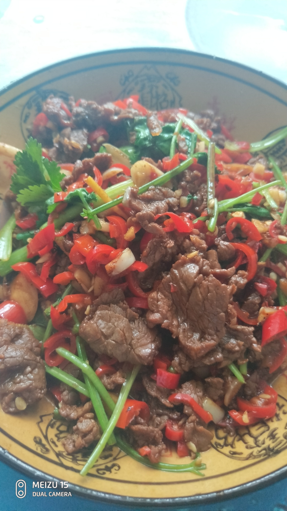

<h1>辣椒炒肉</h1>

## 1.准备材料

###### 1.1 前腿肉,蒜苗,蒜头,辣椒,调料(稍后会说)

## 2.处理材料

###### 2.1 肉切片,蒜头切丁,蒜苗斜刀,辣椒切碎

## 3.处理肉

###### 3.1 肉加适量盐,鸡精,酱油,(这个根据个人口味酌情添加)用兰花指捏拌均匀

###### 3.2 处理后的肉

## 4.炒肉

###### 4.1 先下肥肉

###### 4.2 煎出肥肉里的油

###### 4.3 下瘦肉+蒜末(去肉腥味)

###### 4.4 炒至九分熟出锅,装盘备用

## 5.炒辣椒

###### 5.1 辣椒下入冒黑烟的油锅,并加盐(依个人口味酌情添加)

###### 5.2 辣椒炒到你觉得阔以吃的时候加入蒜苗脑阔和蒜丁

## 6.混合辣椒和肉

###### 6.1 待蒜苗和蒜丁香气溢出时,导入肉,少许水,大火收汁并翻拌均匀

###### 6.2 最后加入蒜叶,并翻拌均匀

###### 6.3 最后待蒜叶熟了,起锅装盘

## 7.配个青菜,美滋滋

###### 7.1 营养生活,荤素搭配!

## 8.彩蛋:

###### 8.1 此教程的肉可以替换为黄牛肉,蒜苗替换为香菜, 即是小炒黄牛肉

###### 8.2.将红辣椒替换成螺丝椒(请切滚刀块),即是那个很有名的费大厨辣椒炒肉

